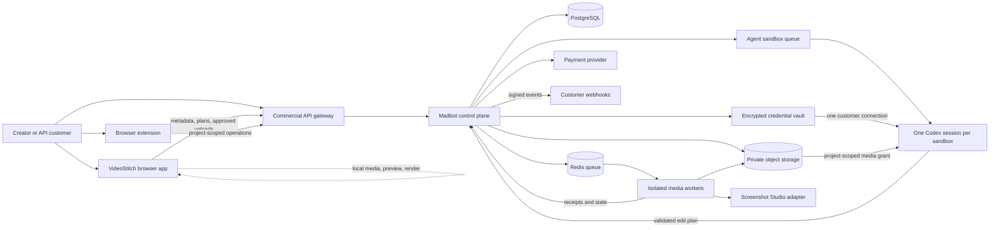
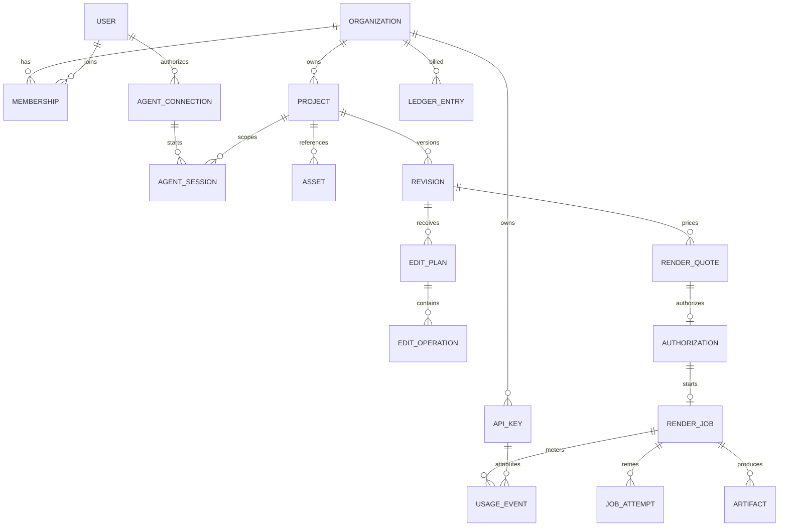

# VideoStitch commercial API and UI plan

**Status:** Proposed
**Version:** 0.1
**Updated:** 2026-08-12

## 1. Product decision

VideoStitch will have two complementary commercial surfaces:

1. A public, local-first editor that earns trust by working without an account,
   upload, or AI connection.
2. A metered cloud API that accepts and validates externally produced edit
   plans, renders approved revisions, and returns deterministic QA receipts.

The public VideoStitch repository owns the browser application, extension,
project and edit-plan schemas, API clients, sanitized fixtures, and public
documentation. The private Madbot repository owns the commercial control plane,
render orchestration, billing, private editorial workflows, and
operations. We should not create a second private repository until the API has
an independent deployment cadence or Madbot's internal domain starts leaking
through the public contract.

### MVP hypothesis

We believe builder-creators and small media teams will pay to turn podcasts,
product demos, and ads into approved deliverables when VideoStitch combines a
reviewable AI edit plan with predictable cloud rendering and QA. We will know
we are right when at least 10 closed-beta accounts each complete two paid jobs,
at least 50% of proposed edit operations are accepted, and valid paid jobs
complete successfully at least 98% of the time within two attempts.

## 2. Commercial packaging

The web app is free. Local editing, project manifests, AI-plan review for plans
supplied by the user or their agent, and compatible browser exports do not
require a subscription. Commercial charges begin only when the user explicitly
requests a VideoStitch-hosted operation. Start with pay-as-you-go cloud usage;
add subscriptions later only for durable team and workflow value.

| Offer | Intended user | Included | Usage model |
| --- | --- | --- | --- |
| Web app | Privacy- and cost-conscious creator | Manual editor, local manifests, AI-plan review, compatible browser preview/export, public skill | Free; no account required |
| Cloud | Creator who needs backend rendering | Signed uploads, edit-plan validation, render jobs, QA, short retention, job history | Pay as you go; no required subscription |
| Studio | Small team or agency | Shared workspace, roles, pooled budget, API keys, webhooks, priority queue and support | Optional subscription plus quoted usage, after MVP |
| API | Developer or agent-first customer | Sandbox, production API, SDKs, idempotency, webhooks, usage dashboard | Pay as you go; volume agreement later |

AI connection is independent of packaging. A customer may use an external
ChatGPT/Codex client, run their own agent or model backend, or opt into a
VideoStitch-managed Codex CLI authenticated to that customer's own account. The
managed option is convenience and orchestration, not bundled AI inventory.

### Pricing hypotheses, not launch commitments

Current official competitor pricing provides useful anchors: Shotstack lists
basic 1080p rendering at $0.30 per output minute on pay-as-you-go and $0.20 on
subscription; JSON2Video's published plans work out to roughly $0.20–$0.42 per
included minute; Creatomate meters video by pixel-processing credits; creator
editors such as Descript generally charge per editor per month and meter media
or AI allowances.

Use these initial hypotheses only after production benchmarks establish cost
and gross margin:

- Web app: **$0** for local editing and compatible local export.
- Cloud account: **$0/month** at launch; hosted operations are quoted per job.
- Studio: later test **$59/month** for three seats and team controls only after
  customers demonstrate demand for shared workflow features.
- API sandbox: free, rate-limited, short retention, watermarked output.
- 1080p cloud render and technical QA: test **$0.30 per output minute**, billed
  by the second with a $0.25 job minimum. AI usage is never billed by VideoStitch.
- 4K render: quote from measured compute; initially model it as up to 4x the
  1080p rate, not as a promise.
- Storage, transfer, and deterministic media processing are separate quote lines
  when they incur material cost.
- Closed beta should use prepaid balances or strict account caps. Do not allow
  unbounded postpaid overages.

The quote is denominated in currency, not proprietary credits. It records the
project revision, input minutes, output minutes, resolution, expected compute,
retention, each line item, taxes if known, a maximum authorized amount, and an
expiration. The final charge may be lower but never higher than the authorized
maximum without a new quote.

### Preliminary live Madbot cost snapshot

At 2026-08-12 10:50 America/Chicago, the active Cruddy Weather revision job had
run for 2 hours 23 minutes on the current 8-vCPU/16-GiB server. The server is
priced at $0.14286/hour and its 500-GiB volume at about $0.074/hour, for an
allocated infrastructure rate near $0.21686/hour. That places infrastructure
consumed so far near **$0.52**: about $0.34 of compute and $0.18 of allocated
storage. The job was still running.

This is a full AI-assisted production revision, not a clean render benchmark.
It includes editorial reasoning, browser recapture, local narration and audio,
15 Screenshot Studio camera clips, three 96-second aspect-ratio masters, and QA.
The three-master render loop itself had run for about 18 minutes, completed the
landscape master, and was rendering the square master. If all three masters take
roughly 36 minutes, their allocated infrastructure is approximately **$0.13**,
or **$0.027 per output minute** across 4.8 output minutes. Compute alone would be
about $0.086, or $0.018 per output minute.

These figures exclude model/API subscription cost, payment fees, egress,
support, failed-job reserve, taxes, and idle capacity. They support a free web
app and inexpensive cloud rendering, but they do not yet justify a final retail
rate. Instrument several clean jobs before replacing the provisional quote
formula.

The current internal Madbot workflow uses a $200/month ChatGPT Pro account. If
one ad consumes 5% of a **weekly** Codex allowance, a simple subscription-cost
allocation is $200 / 4.345 weeks x 5%, or approximately **$2.30 per ad**. Added
to the live infrastructure snapshot, that puts this full workflow near
**$2.82-$2.95 per completed ad** if it finishes within roughly three hours. If
the observed 5% is a monthly meter, the allocation is instead $10; if it is the
rolling five-hour meter, it cannot be mapped directly to monthly dollars.

This allocation is useful for internal economics only. VideoStitch does not
resell AI. A customer-connected ChatGPT/Codex agent can reason under that
customer's own plan and submit edit operations through VideoStitch's public
tools. Alternatively, the customer may explicitly authorize an isolated Codex
CLI runner on VideoStitch infrastructure; its OpenAI usage still belongs to that
customer. A developer using a model API runs it under their own provider account
and submits the resulting structured edit plan.

Live Codex session telemetry gives a more relevant hosted-API estimate. At
2026-08-12 11:13 America/Chicago, the active revision session had accumulated
approximately 103.55M input tokens, of which 102.49M were cached, plus 43K output
tokens. At GPT-5.6 Sol API rates of $5/M uncached input, $0.50/M cached input,
and $30/M output, the model-equivalent cost was already approximately **$57.84**.
With Madbot infrastructure, the unfinished workflow was near **$58.44** before
payment fees, support, or retry reserve.

This confirms the product decision not to buy or sell hosted inference.
Developers and customers own model selection, prompts, context, limits, and
provider billing even when VideoStitch operates their isolated Codex runner.
VideoStitch owns the constrained operation schema, validation, runner isolation,
deterministic media processing, rendering, artifacts, and QA.

### Recommended launch rate card

Do not bundle dissimilar work into one video-minute price:

| Operation | Launch price hypothesis | Meter |
| --- | ---: | --- |
| Local editor and local export | $0 | No meter |
| API account and sandbox | $0/month | Sandbox limits and watermark |
| 1080p deterministic render plus technical QA | $0.30 | Per output minute, billed by second |
| Cloud-job minimum | $0.25 | Per production job |
| Temporary source/artifact retention | Included for 24 hours | Then quoted by GB-day |
| Customer-agent edit operations | $0 plus cloud work | Customer's agent supplies reasoning; VideoStitch validates operations |
| Edit-plan validation and application | Included | Deterministic schema and revision checks |
| Additional revision renders | Same render rate | Only affected outputs are charged |

VideoStitch never adds a model markup because it never incurs or intermediates
the model charge. The user's agent may propose an entire ad, podcast edit, or
clip set; our invoice covers only the cloud operations the user approves.

Use prepaid balances in $10 or larger increments during beta so a $0.25 job is
not individually consumed by card-processing minimums. Offer volume discounts
only against measured spend: consider 10% at $100/month and 20% at $500/month,
with explicit concurrency and support tiers rather than an unlimited plan.

## 3. User experience and information architecture

### Public and local experience

| Route | Purpose | Account required |
| --- | --- | --- |
| `/` | Product proof, privacy promise, examples, and clear local start | No |
| `/editor/new` | Create a local project and import media | No |
| `/editor/:localProjectId` | Timeline, transcript, captions, AI-plan diff, preview, export | No for local work |
| `/examples` | Reproducible podcast, ad, demo, and vertical examples | No |
| `/developers` | API overview, schemas, SDKs, sandbox, and status | No |
| `/pricing` | Subscription features and measurable usage rates | No |

### Signed-in commercial experience

| Route | Primary job |
| --- | --- |
| `/app/projects` | Resume local/cloud-linked projects and inspect job status |
| `/app/projects/:id` | Edit, review plans, compare revisions, preview, quote, approve, download |
| `/app/renders` | Filter queued, active, failed, expiring, and completed jobs |
| `/app/usage` | See usage by project, API key, operation, and day |
| `/app/billing` | Balance, invoices, spend caps, payment method, and retention charges |
| `/app/developers` | Create named scoped keys, register webhooks, inspect logs, copy examples |
| `/app/team` | Members, roles, project grants, and budget permissions |

### Editor layout

The editor has five stable regions:

1. Asset/project rail: local versus cloud residency is visible on every asset.
2. Player/canvas: preview quality and render engine are labeled.
3. Timeline/transcript: humans and AI operate on the same revision.
4. Inspector: selected clip, caption, effect, redaction, or output settings.
5. Proposal drawer: exact operations, source spans, confidence, rationale,
   protected beats, estimated output, and accept/reject controls.

Commercial actions use a consistent progression:

```text
local project -> choose cloud operation -> disclose upload -> create quote
-> inspect preview/settings/retention -> authorize maximum -> process
-> deterministic QA -> review artifact -> approve/download
```

Render success and user approval are distinct states. Publishing is not part of
the MVP.

### High-impact UI rules

- "Connect AI" never implies that a ChatGPT subscription supplies API credits.
- No media upload begins when a user merely opens an AI panel.
- The upload dialog lists exact assets, proxy/full-resolution choice, purpose,
  region when available, and retention.
- A paid button includes the maximum amount and revision identifier.
- API keys are shown once, named, scoped, prefix-identifiable, and revocable.
- Usage pages display dollars and physical units, not only abstract credits.
- Failed jobs expose an actionable stable error code but no worker internals.
- Destructive deletion, paid authorization, and future publishing permissions
  remain separate scopes.

## 4. System architecture

Start with a modular commercial monolith inside Madbot. Use one API deployment,
one PostgreSQL database with module-owned tables, Redis/Celery for asynchronous
work, S3-compatible object storage, and isolated media workers. Extract a
service only when independent scaling or deployment is proven necessary.



### Module boundaries

| Module | Responsibility | Owns | External surface |
| --- | --- | --- | --- |
| Identity | Users, organizations, sessions, roles | users, organizations, memberships | UI session endpoints |
| Developer access | Named API keys, scopes, rate limits, webhook secrets | api_keys, webhook_endpoints | developer dashboard and auth middleware |
| Projects | Cloud metadata, residency, revisions, approvals | projects, assets, revisions, approvals | `/v1/projects`, `/v1/assets` |
| Edit plans | Validate and apply versioned operations | edit_plans, operations, validation_results | `/v1/edit-plans` |
| Agent connections | External agents and managed Codex authorization, status, revocation, and opaque secret references | agent_connections, connection_audit_events | account connection UI; private runner API |
| Agent sessions | Sandbox lifecycle, one-session ownership, project grants, resumability, and termination | agent_sessions, sandbox_leases | private queue contracts only |
| Quotes and billing | Price, authorization, ledger, invoice linkage | quotes, authorizations, ledger_entries | `/v1/render-quotes`, billing UI |
| Jobs | Queue state, retries, cancellation, progress | jobs, job_attempts, artifacts | `/v1/render-jobs`, webhooks |
| Worker adapters | Screenshot Studio, FFmpeg, media probes, caption alignment, QA | no customer system of record | private queue contracts only |
| Usage | Meter accepted work and aggregate cost | usage_events, daily_rollups | `/v1/usage` and dashboard |

Only the owning module writes its tables. Worker adapters return signed or
authenticated receipts; they do not settle charges directly.

### Managed Codex sandbox lifecycle

1. The customer authorizes one `AgentConnection` through the official Codex
   browser or device-code flow.
2. The control plane creates a sandbox lease bound to organization, user,
   connection, project, and base revision.
3. The sandbox receives its own encrypted `CODEX_HOME`, one Codex session, a
   read-only project/media grant, a writable scratch volume, and a constrained
   VideoStitch tool surface.
4. The Codex session may pause and resume inside that same ownership boundary.
   A sandbox is never reassigned across customers, and a session cannot silently
   cross projects.
5. The session returns structured edit operations and safe progress events. It
   cannot authorize spend, publish, access another tenant, or invoke arbitrary
   infrastructure controls.
6. Completion, cancellation, timeout, revocation, or deletion terminates the
   lease. Scratch media is deleted by policy; resumable session state and the
   credential cache follow their separately disclosed retention settings.

Agent sandboxes and deterministic render workers are separate pools. Codex may
propose an edit and request a quote, but only the render worker receives an
authorized immutable revision and output specification.

### Domain model



Use UUIDv7 identifiers, UTC timestamps, integer milliseconds for media time,
content hashes for assets/revisions, and integer minor currency units for money.

## 5. API v1 contract

Use `https://api.videostitch.dev/v1` as a documentation placeholder until the
production domain is selected. JSON is the control format; media transfers use
short-lived signed URLs directly to object storage.

### Authentication and authorization

- Browser UI: secure, HTTP-only session established through OAuth/passkey or
  magic-link authentication.
- API: `Authorization: Bearer vst_live_...` or `vst_test_...`.
- Store only a strong hash of the secret; retain a short prefix for lookup.
- Keys are named and scoped: `projects:read`, `projects:write`, `assets:write`,
  `plans:write`, `previews:create`, `quotes:create`, `renders:create`,
  `artifacts:read`, and `usage:read`.
- `renders:create` is excluded by default and is constrained by organization,
  key, daily, and per-job spend caps.
- User/session management, payment methods, and key creation form a management
  API and are excluded from marketplace/media OpenAPI documents.
- Managed Codex connections are separate from VideoStitch API keys. Browser or
  device-code login is handled by Codex CLI inside a tenant-specific auth
  environment; the resulting credential cache is encrypted outside the
  application database and referenced only by opaque connection ID.
- Every managed run binds organization, user, connection, project revision,
  media grants, and output destination before entering the queue. Workers fail
  closed on any mismatch and receive no cross-tenant filesystem or credential
  access.
- Disconnecting a managed connection blocks new runs immediately and schedules
  the credential cache for deletion. Tokens and one-time login codes are never
  exposed in logs, analytics, webhooks, support bundles, or API responses.

### Core endpoints

| Method | Path | Purpose |
| --- | --- | --- |
| `GET` | `/capabilities` | Versions, formats, limits, operations, and current degradation |
| `POST` | `/projects` | Create cloud metadata and policy |
| `GET` | `/projects/{project_id}` | Read project and current revision |
| `POST` | `/projects/{project_id}/assets/uploads` | Create a signed multipart upload plan |
| `POST` | `/assets/{asset_id}/complete` | Verify hash/probe result and seal immutable asset |
| `POST` | `/projects/{project_id}/edit-plans` | Submit a structured human/agent plan |
| `POST` | `/edit-plans/{plan_id}/validation` | Validate against schema, policy, and base revision |
| `POST` | `/edit-plans/{plan_id}/application` | Apply selected operations into a new revision |
| `POST` | `/projects/{project_id}/previews` | Request low-cost frames, proxy, or short preview |
| `POST` | `/projects/{project_id}/render-quotes` | Quote an exact revision and output set |
| `POST` | `/render-quotes/{quote_id}/authorization` | Authorize up to the quoted maximum and create job |
| `GET` | `/render-jobs/{job_id}` | Read state, progress, price, and safe failure detail |
| `POST` | `/render-jobs/{job_id}/cancellation` | Request cancellation and release eligible funds |
| `GET` | `/render-jobs/{job_id}/artifacts` | Get expiring download URLs and QA receipts |
| `GET` | `/usage` | Cursor-paginated metering records and rollups |

All mutating requests require `Idempotency-Key`. Revision mutations also require
`If-Match: <revision_hash>`. Responses include `request_id`; asynchronous
creates return `202 Accepted` and a resource URL.

### Quote request example

```json
{
  "revision_id": "rev_019...",
  "outputs": [
    {
      "name": "vertical-short",
      "container": "mp4",
      "video_codec": "h264",
      "width": 1080,
      "height": 1920,
      "fps": 30
    }
  ],
  "retention_days": 7,
  "include_qa_report": true
}
```

### Quote response example

```json
{
  "id": "quote_019...",
  "revision_hash": "sha256:...",
  "currency": "USD",
  "line_items": [
    { "kind": "render", "quantity": 52.4, "unit": "output_second", "amount_minor": 35 },
    { "kind": "qa", "quantity": 1, "unit": "job", "amount_minor": 10 }
  ],
  "maximum_amount_minor": 45,
  "expires_at": "2026-08-12T22:30:00Z",
  "retention_days": 7
}
```

### Stable error shape

```json
{
  "error": {
    "code": "stale_revision",
    "message": "The edit plan targets an older project revision.",
    "field": "base_revision_id",
    "request_id": "req_019...",
    "retryable": false
  }
}
```

Initial codes include `invalid_request`, `authentication_required`,
`insufficient_scope`, `rate_limited`, `quota_exceeded`, `stale_revision`,
`asset_hash_mismatch`, `unsupported_media`, `quote_expired`,
`authorization_required`, `spend_cap_exceeded`, `job_not_cancellable`,
`render_failed`, and `artifact_expired`.

### Job and billing state

```text
draft -> quoted -> authorized -> uploading -> queued -> preprocessing
-> rendering -> qa -> succeeded | failed | cancelled | expired
```

Authorization is not capture. Capture occurs only for successfully completed,
metered work; failed jobs release or refund the unused authorization. Retries
are bounded, share one customer job ID, and cannot duplicate settlement.

### Webhooks

Initial events: `asset.ready`, `edit_plan.validated`, `preview.succeeded`,
`render.started`, `render.progress`, `render.succeeded`, `render.failed`,
`render.cancelled`, `artifact.expiring`, and `quote.expired`.

Sign payloads with timestamped HMAC signatures, retain event IDs, retry with
backoff, stop after a documented window, and provide dashboard replay. Payloads
contain resource identifiers and safe metadata, never raw transcript text,
credentials, or signed download URLs.

## 6. Reliability, security, and operations

### Initial service objectives

- Control API availability: 99.9% monthly target after closed beta.
- Non-upload API p95 latency: under 400 ms.
- Accepted job starts: within 60 seconds at normal beta load.
- Valid paid render completion: at least 98% within two attempts.
- Unauthorized spend, publication, or cross-tenant asset access: zero.
- Source deletion: enforced within the displayed retention window plus a
  documented deletion-processing allowance.

### Required controls before accepting money

- Tenant-scoped object keys and database authorization tests.
- Content type, size, codec, duration, and hash validation.
- Signed upload/download URLs with short expirations.
- Encryption in transit and at rest; secrets excluded from logs and support
  bundles.
- Named, hashed API keys with immediate revocation and fail-closed scopes.
- Organization/key/IP rate limits and concurrency limits.
- Idempotent authorization, capture, release, retry, and refund ledger entries.
- Worker health, heartbeat, queue depth/age, stuck-job, disk, and dependency
  checks before accepting authorization.
- Full-decode and stream QA plus representative frames; captions, privacy,
  framing, and sync gates where applicable.
- Audit trail for uploads, plan applications, quotes, authorization, downloads,
  and deletion.
- Terms, privacy policy, retention disclosure, abuse handling, support path,
  and user rights attestation.

Madbot currently contains valuable operator workflows and a server deployment,
but it is not yet a multi-tenant commercial control plane. In particular, its
existing absolute-path compatibility layer, broad internal workspace, and
operator-centric tooling must stay behind isolated adapters rather than becoming
customer-visible assumptions.

## 7. MVP cut line

### Current dependency assessment

The public scaffold currently has two runtime dependencies (`react` and
`react-dom`) and a Vite/TypeScript build toolchain. There are no domain modules
or internal import cycles yet. Keep the canonical schemas framework-neutral;
generate TypeScript bindings into the UI rather than making schema definitions
depend on React. Madbot's production dependencies are intentionally not imported
into this public package, so the private worker graph can evolve independently.

### Must have: paid closed beta

| Capability | Why it is required | Risk | Effort |
| --- | --- | --- | --- |
| Local editor project/revision model | Establishes the product and shared contract | High | XL |
| One MP4 upload path with explicit consent | Enables cloud analysis/rendering | High | L |
| One podcast/demo edit-plan schema and diff | Tests the inspectable-AI wedge | High | L |
| 1080p H.264/AAC render for one output at a time | Completes the paid job | High | XL |
| Quote, prepaid authorization, ledger, refund/release | Required before charging | High | L |
| Account, organization, named API key, core scopes | Supports UI and API customers safely | Medium | L |
| Job status, cancellation, artifacts, signed webhook | Makes asynchronous API usable | Medium | L |
| Deterministic technical QA receipt | Justifies trust and premium | High | L |
| Usage and spend-cap dashboard | Prevents surprise charges | Medium | M |
| Retention and deletion enforcement | Required for user media trust | High | L |

### Should have: immediately after beta proof

- Multiple output variants from one approved revision.
- Transcript generation and transcript-based editing.
- Reusable templates and brand presets.
- Selective operation acceptance and conflict visualization.
- SDKs for TypeScript and Python generated from OpenAPI.
- Webhook replay and richer API request logs.
- Team roles beyond owner and developer.

### Could have: demand-triggered

- 4K when at least 10 paying accounts request it and margins are benchmarked.
- Batch API when customers repeatedly submit 20 or more related renders.
- Longer retention when customers pay for it and deletion operations are proven.
- Marketplace distribution after direct API onboarding and support are stable.

### Won't have in the commercial MVP

- Automatic social publishing or scheduling.
- Password, browser-cookie, or pasted-auth-cache collection; pooled ChatGPT
  accounts; or bundled ChatGPT subscription claims.
- VideoStitch-funded model inference or AI-token resale.
- Persistent BYO model keys.
- Simultaneous collaborative editing.
- Arbitrary customer FFmpeg commands, arbitrary code, or worker shell access.
- Unlimited formats, durations, resolution, concurrency, storage, or retries.
- Self-serve postpaid overages.

## 8. Risk-first delivery sequence

### Foundation

Freeze `Project`, `Revision`, `EditPlan`, `Operation`, `RenderQuote`, `RenderJob`,
and `QAReceipt` JSON Schemas in the public repository. Build golden local
fixtures and prove stale-revision rejection, deterministic validation, and
project recovery.

### Render spike

Wrap exactly one existing Madbot/Screenshot Studio path behind a narrow private
adapter. Benchmark 30-second, 5-minute, and 45-minute representative sources;
measure wall time, CPU, memory, scratch space, retries, and output QA. Do not add
billing until this establishes a safe quote formula and capacity envelope.

### Control plane

Add organization isolation, signed upload flow, queue, state machine, artifact
retention, audit records, and API-key auth. Use sandbox jobs first and verify
cross-tenant denial tests.

### Commercial loop

Add quote, prepaid authorization, idempotent ledger, spend caps, cancellation,
and usage UI. Run only Wiplash-owned fixtures, then invited design partners.

### Paid closed beta

Admit accounts manually, enforce low limits, provide direct support, and review
every failed or refunded job. Raise concurrency or automate onboarding only
after margins, deletion, support burden, and retry behavior are measured.

## 9. Architecture decisions

### ADR-001: Modular monolith in Madbot

- **Status:** Proposed
- **Context:** The team and domain are early; rendering scales differently but
  the commercial account, project, quote, and job boundaries are still moving.
- **Decision:** Build one private control-plane application with module-owned
  tables and queue isolated workers.
- **Consequences:** Faster iteration and one transactional database; discipline
  is required to keep private worker details behind ports.
- **Alternatives:** New private API repository now (premature operational split),
  independent microservices (unnecessary deployment and consistency cost).

### ADR-002: Contract-first public schemas

- **Status:** Proposed
- **Context:** Browser UI, external agents, and private workers must manipulate
  the same project without sharing implementation code.
- **Decision:** Version JSON Schema/OpenAPI in VideoStitch and generate types and
  validators for public and private consumers.
- **Consequences:** Breaking changes require explicit versions and fixtures;
  private capabilities cannot leak into undocumented fields.
- **Alternatives:** Share Madbot models directly (couples public clients to
  private internals), free-form agent JSON (unsafe and irreproducible).

### ADR-003: Quote before cloud work and charge

- **Status:** Proposed
- **Context:** Media jobs vary materially in transfer, storage, output, and render
  cost.
- **Decision:** Every paid job binds an expiring quote and maximum authorization
  to an immutable revision and output specification.
- **Consequences:** An extra API/UI step, but predictable spend, safer retries,
  and clean billing disputes.
- **Alternatives:** Monthly opaque credits (weak transparency), postpaid usage
  without caps (unacceptable beta risk), flat unlimited plans (margin risk).

### ADR-004: One customer Codex session per isolated sandbox

- **Status:** Accepted for managed-runner beta.
- **Context:** VideoStitch may operate Codex CLI under a customer's own ChatGPT
  identity, making the service custodian of a refreshable credential and of the
  media/context visible to that session.
- **Decision:** Reuse the private sandbox/container pattern proven by Wiphand.
  Bind every sandbox and Codex session to exactly one customer connection and
  one explicit project grant. Keep agent sandboxes separate from render workers.
- **Consequences:** VideoStitch must operate encrypted credential storage,
  revocation, sandbox scheduling, session retention, egress controls, and
  auditable tenant checks. Customers retain OpenAI usage responsibility, and
  VideoStitch never adds an AI usage charge.
- **Alternatives:** External-only agents (lower custody risk but less convenient),
  shared Codex homes or shared sessions (rejected as a cross-tenant risk), or a
  VideoStitch-owned model account (rejected because it transfers AI cost).

## 10. Decisions for product review

The architecture can proceed with reversible defaults. Before public pricing or
paid beta, the product owner needs to approve:

1. Primary closed-beta segment: podcast/tutorial creators is recommended over
   generic API automation because it best tests inspectable AI editing.
2. Which collaboration signal should trigger the optional Studio subscription;
   the web app and individual cloud account remain free of monthly fees.
3. Whether prepaid wallet funding or per-quote payment authorization is the
   first billing experience; prepaid is operationally safer.
4. Maximum source duration, file size, output duration, retention, and concurrent
   jobs based on render-spike evidence.
5. Which Wiplash-owned podcast/demo/ad fixtures become public golden examples.

## Sources used for market anchors

- [Shotstack pricing](https://shotstack.io/pricing/)
- [Shotstack API and limits](https://shotstack.io/docs/guide/architecting-an-application/limitations/)
- [Creatomate pricing](https://creatomate.com/pricing)
- [Creatomate credit calculation](https://creatomate.com/docs/account/how-are-credits-calculated)
- [JSON2Video API pricing](https://json2video.com/pricing/)
- [Descript pricing](https://www.descript.com/price)
